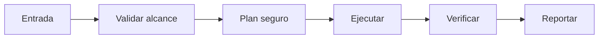

# 🛡️ Aegis Veil

<p align="center">
  
</p>

<p align="center">
  <a href="./README.md"></a>
  <a href="./README.es.md"></a>
</p>

## Resumen
Escudo anti-prompt-injection y skill poisoning: analiza cada skill nueva instalada (incluidas las auto-generadas), detecta payloads ocultos, backdoors o instrucciones maliciosas antes de ejecutar. Sandboxea y reporta riesgos.

## Instalación
```bash
git clone https://github.com/smouj/Aegis-Veil.git
cd Aegis-Veil
cat SKILL.es.md
```

## Arquitectura de entendimiento


## Estado
Iniciando

## Dificultad
Media-Alta
