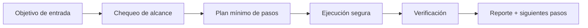

# 🛡️ Aegis Veil

<p align="center">
  
</p>

<p align="center">
  <a href="./README.md"></a>
  <a href="./README.es.md"></a>
</p>

<p align="center"><em>🛡️ Escudo anti-prompt-injection y skill poisoning.</em></p>

---

## Resumen
Escudo de protección contra prompt injection y skill poisoning. Implementa detección heurística de intentos de manipulación, sandboxing de ejecución y monitoreo en tiempo real de vectores de ataque conocidos.

## Arquitectura de entendimiento


## Instalación
```bash
git clone https://github.com/smouj/Aegis-Veil.git
cd Aegis-Veil
cat SKILL.es.md
```

## Uso rápido
```bash
printf "ejecutando aegis-veil...\n"
```

## Estado
- Status: Iniciando
- Dificultad: Media-Alta

## Roadmap
- [ ] Implementar lógica core v0
- [ ] Añadir tests de integración
- [ ] Publicar tag estable v1.0.0
