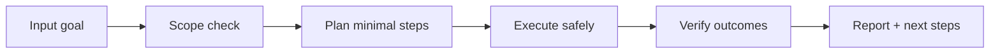

# 🛡️ Aegis Veil

<p align="center">
  
</p>

<p align="center">
  <a href="./README.md"></a>
  <a href="./README.es.md"></a>
</p>

<p align="center"><em>🛡️ Escudo anti-prompt-injection y skill poisoning.</em></p>

---

## Overview
Escudo de protección contra prompt injection y skill poisoning. Implementa detección heurística de intentos de manipulación, sandboxing de ejecución y monitoreo en tiempo real de vectores de ataque conocidos.

## Architecture of understanding


## Installation
```bash
git clone https://github.com/smouj/Aegis-Veil.git
cd Aegis-Veil
# read the contract
cat SKILL.md
```

## Quick usage
```bash
# Example placeholder command
printf "running aegis-veil...\n"
```

## Badges
- Status: Initiating
- Difficulty: Media-Alta

## Roadmap
- [ ] Implement core logic v0
- [ ] Add integration tests
- [ ] Publish stable tag v1.0.0
